# Meowdoku
## A Sudoku Android App
Programmed in C# and developed using the Unity Engine and soon to be avaliable for download on Android, Meowdoku is a fun cute sudoku game with cat themed UI elements and animations.  
Every element of the UI was hand-drawn. Animations done by hand frame-by-frame. All assets are original, made by myself (Kaylee Nasser).  

Sudoku background music created by AstroForte.  

### Features:
- Settings (with volume slider)
- Music
- How to Play
- 4 Difficulties (Easy, Medium, Hard, Expert)
- Lives - 3 Mistakes before game over
- Notes - 1 - 9 can be placed in one box without affecting lives
- Eraser - Erases everything in a box

### To do:
- Continue/Save feature
- Anchor buttons differently - i.e. back button on main menu

### Future updates:
- Endless mode (play until completion, no lives or help)
- Hints

# A Meowdoku Walkthrough
The game opens on a main menu screen:  
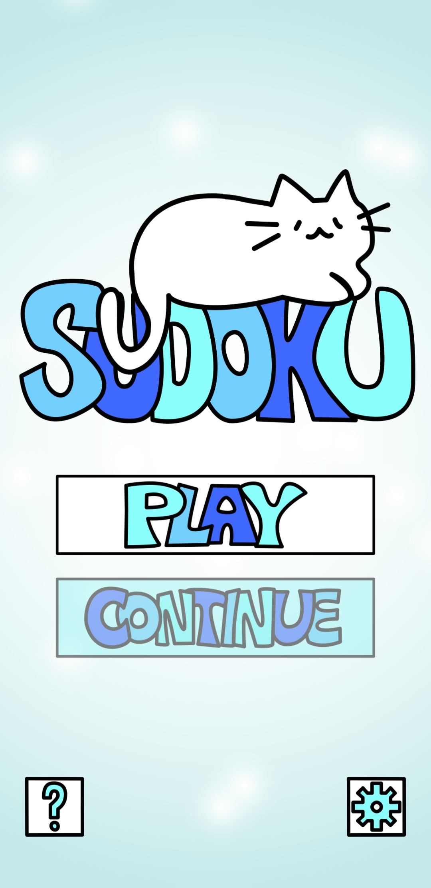  

The menu features three main working buttons:  
*Note: As of now, the continue button is not functional*  
1. The settings button allows the user to change the music volume in the app, see any known bugs, and look for future updates. It can be closed with the "X" in the top left.       
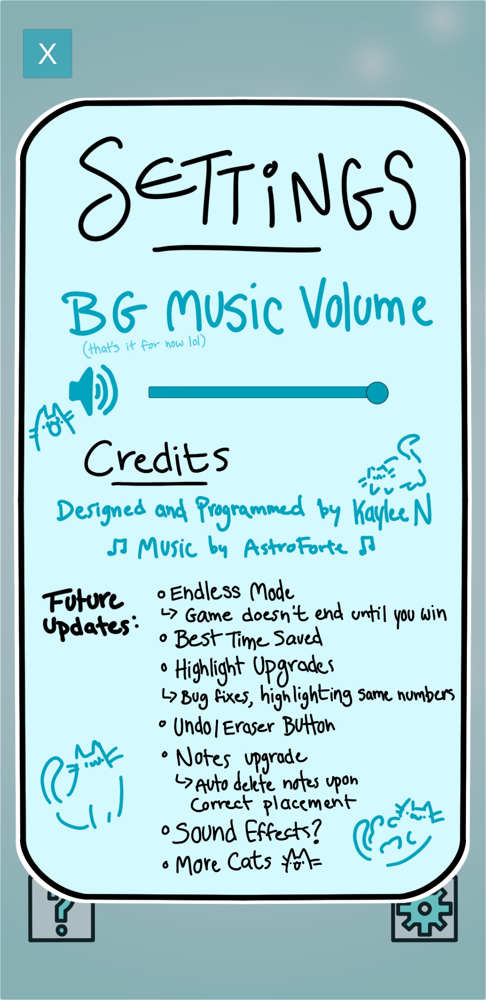     
2. The question mark button explains to the user how to play Meowdoku. It can be closed with the "X" in the top left.      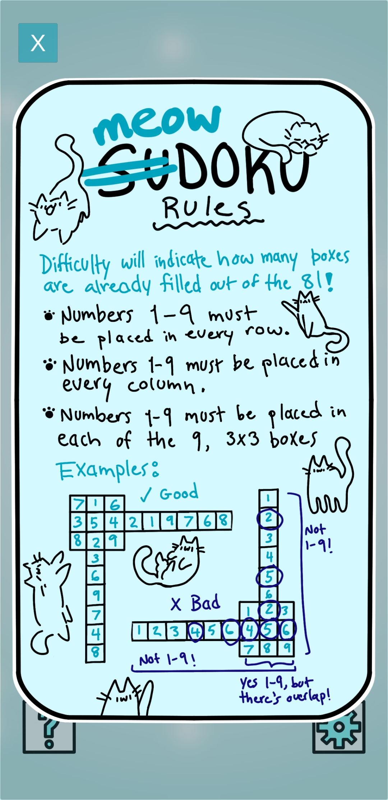       
3. The play button takes the user to the difficulty select screen, the main menu can be returned to with the back button.      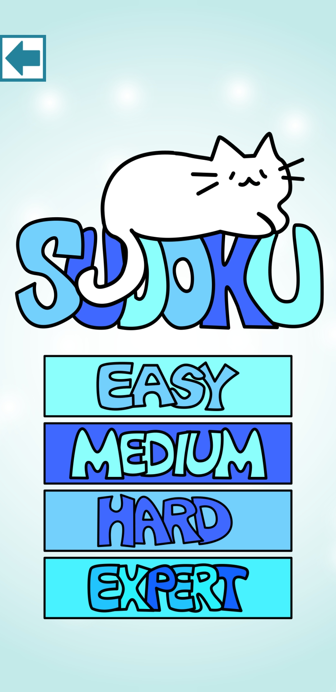      

When a difficulty is selected, a sudoku game will open with the selected difficulty:    
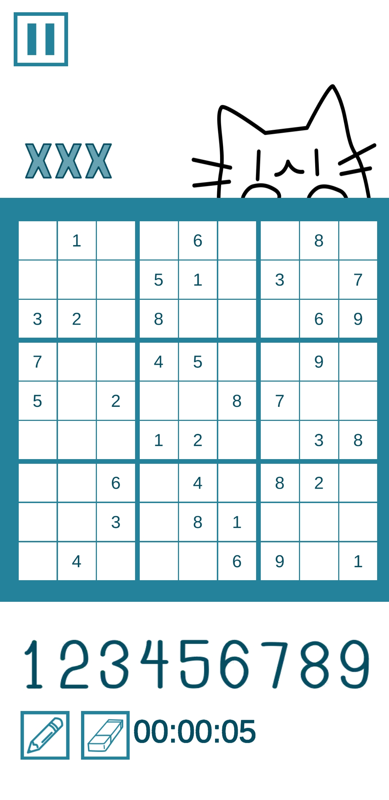   

If the player wants to pause the game and timer, they can tap the pause button in the top left:    
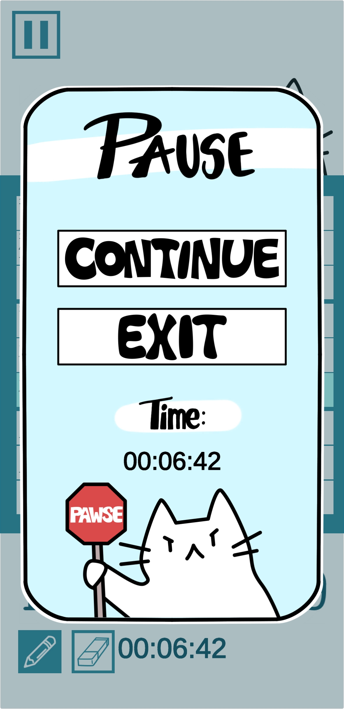   

When selecting a square on the board, a highlight will appear:  
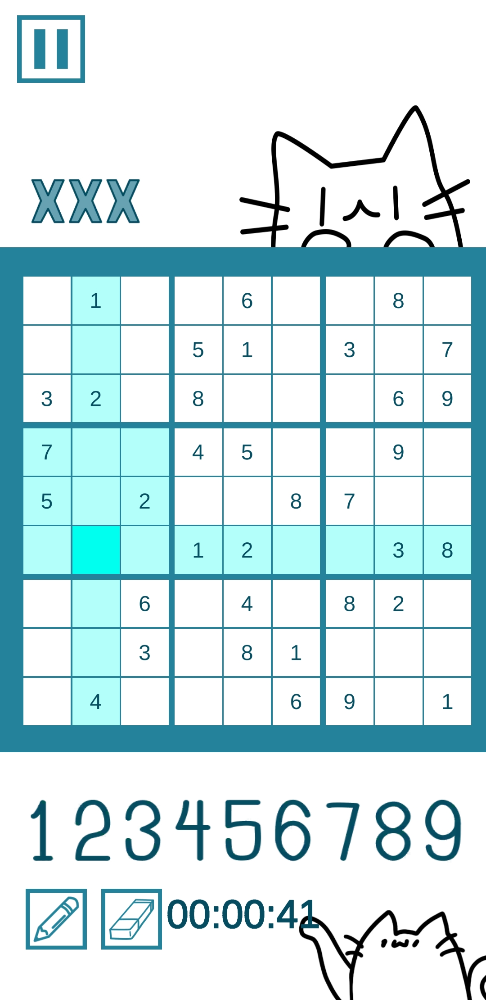    

The player can make notes by tapping the pencil button. It turns blue indicating notes are enabled.   
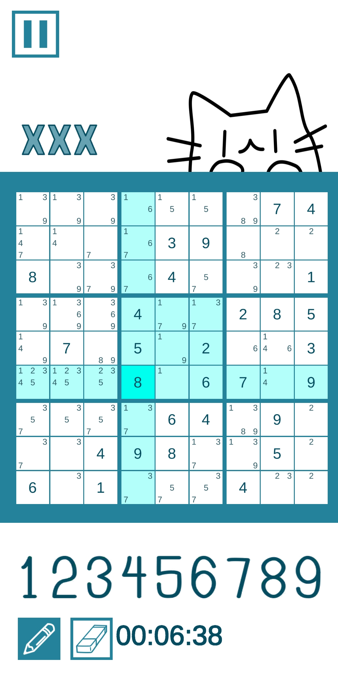    

The player has three lives. If the player makes an error when notes is disabled, the square will turn red and a strike will appear in the top left.    
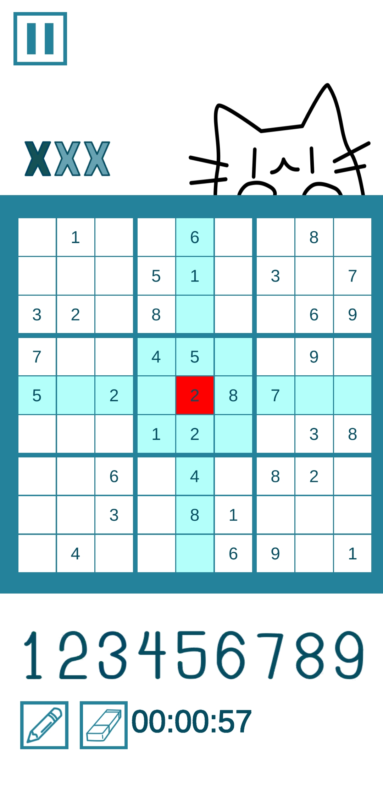

If the player accumlates three strikes, a game over screen will appear giving the user the choice to retry the same board, or return to the main menu.   
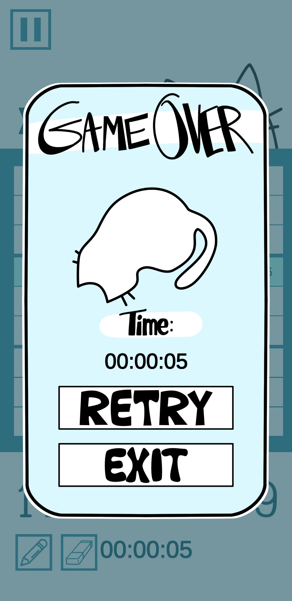 

If the board is completed and there are less than three strikes, a win screen will appear:  
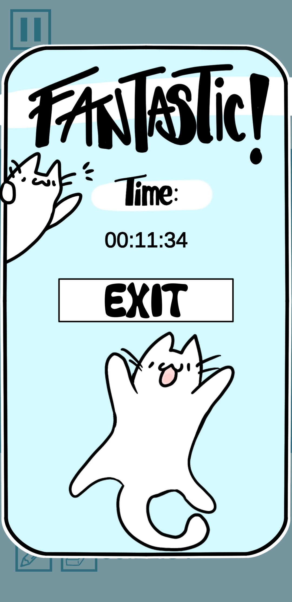 
